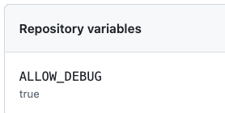

# workflows-lessons-learned

[](https://github.com/ralfstuckert/workflows-lessons-learned/actions/workflows/call-reusable.yaml)


## Always provide environment input parameter
```yaml
on:
  workflow_call:
    inputs:
      environment:
        description: "The optional environment to use (e.g. for accessing environment secrets)"
        required: false
        type: string
...
jobs:
  build:
    ...
    environment: ${{ inputs.environment }}
```


## Support project located in sub-directories
```yaml
on:
  workflow_call:
    inputs:
      ...
      project-root:
        description: "the root of the project, default is '.'"
        default: "."
        type: string
        required: false
  ...
    steps:
    - name: do some stuff
      shell: bash
      working-directory: ${{ inputs.project-root }}
      run: echo "do some stuff"
```


## Make commands configurable
```yaml
on:
  workflow_call:
    inputs:
      ...
      run-build-cmd:
        description: "the command used to trigger the build, default is 'npm run build'"
        default: "npm run build"
        type: string
        required: false
...
    steps:
    - name: run build
      working-directory: ${{ inputs.project-root }}
      run: ${{ inputs.run-build-cmd }}
```
      
      
## Pass calculated values as output
```yaml
on:
  workflow_call:
  ...
      outputs:
      image-version: 
        description: "the image-version. Intended to be used on CI builds only, as this value is caclulated in this workflow."
        value: ${{ jobs.build.outputs.image-version }}
jobs:
  build:
    ...
    outputs:
       image-version: ${{ env.IMAGE_VERSION }}
    ...
    steps:
    - name: determine image version
      working-directory: ${{ inputs.project-root }}
      run: |
        echo IMAGE_VERSION=SNAPSHOT-${{ github.run_number }} >> $GITHUB_ENV;
```


## Provide common data as (env-) variables
```yaml
    ...
    steps:
    - name: evaluate branch
      shell: bash
      working-directory: ${{ inputs.project-root }}
      run: |
        echo "BRANCH=${{ github.head_ref || github.ref_name }}" >> $GITHUB_ENV;
        echo "DEFAULT_BRANCH=${{ github.event.repository.default_branch }}" >> $GITHUB_ENV;
```


## Provide repeated expressions as (env-) variables
```yaml
jobs:
  build:
    ...
    env:
      IS_DEPENDABOT: ${{ github.actor == 'dependabot[bot]' }}
      PUSH_DOCKER_IMAGE: ${{ github.event_name != 'pull_request' }}
    ...
    steps:
    - name: push docker image
      if: env.PUSH_DOCKER_IMAGE == 'true'
```


## Always provide optional debug step
```yaml
    steps:
    ...
   - name: Debug
      if: always() && env.DO_DEBUG == 'true'
      uses: mxschmitt/action-tmate@v3
      with:
        timeout-minutes: 15
```


## Prohibit exclusive functionality
```yaml
on:
  workflow_call:
    inputs:
      ...
      debug:
        description: "debug build on runner. This must be authorized by admin"
        default: false
        type: boolean
        required: false
    ...
    steps:
    ...
    - name: check strict parameters
      shell: bash
      working-directory: ${{ inputs.project-root }}
      run: |
        echo "checking strict parameters"
        if [[ ( '${{ inputs.debug }}' != 'false' ) ]]; then 
          if [[ '${{ vars.ALLOW_DEBUG }}' ==  'true' ]]; then 
            echo  "DO_DEBUG=true" >> $GITHUB_ENV;
          else
            echo "::error ::you are not authorized to debug"; exit 1; 
          fi
        fi

    ...
   - name: Debug
      if: always() && env.DO_DEBUG == 'true'
```



## Force workflow updates
```yaml
jobs:
  build:
    ...
    env:
      WORKFLOW_VERSION: v0.8.0

    ...
    steps:
    ...
    - id: get-latest-release
      uses: pozetroninc/github-action-get-latest-release@v0.7.0
      with:
        repository: ralfstuckert/workflows-lessons-learned
        excludes: prerelease, draft
        
    - name: check workflow version
      shell: bash
      working-directory: ${{ inputs.project-root }}
      run: |
        if [[ ( $WORKFLOW_VERSION != '${{ steps.get-latest-release.outputs.release }}' ) ]]; then 
          echo "::error ::you are using an outdated workflow version $WORKFLOW_VERSION, you must update to ${{ steps.get-latest-release.outputs.release }}"; exit 1; 
        fi
```


## Badges accessing private data

https://schneegans.github.io/tutorials/2022/04/18/badges
```yaml
      - name: Code Coverage Report
        id: coverage
        ...
      - name: Create Coverage Badge
        uses: schneegans/dynamic-badges-action@v1.6.0
        with:
          gistID: ${{ secrets.GIST_ID }}
          auth: ${{ secrets.CREATE_GIST_PAT }}
          filename: badge.json
          label: coverage
          message: ${{ steps.coverage.outputs.coveragePercentageString }}
          valColorRange: ${{ steps.coverage.outputs.coveragePercentage }}
          maxColorRange: 90
          minColorRange: 50
```
[Gist](https://gist.github.com/ralfstuckert/0d07669ba32bae935e2f68935ff4d7d6)
```json
{ "schemaVersion": 1, "label": "coverage", "message": "30%", "color": "hsl(0, 100%, 40%)" }
```


